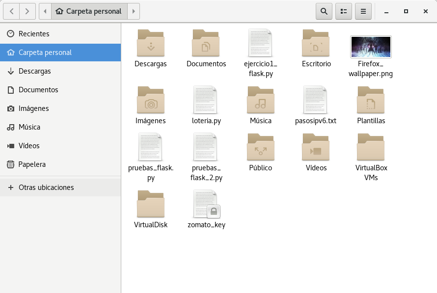

# Esquema Linux.
- Disco Virtual: 2GB
- Partición Primaria: 1GB, Formato ext3
- Partición Primaria: 1GB, Formato ntfs

### Creación del disco virtual.
Creación del disco.
~~~
jesus@debian:~/VirtualDisk$ dd if=/dev/zero of=disco-virtual.img bs=512 count=4194304
4194304+0 registros leídos
4194304+0 registros escritos
2147483648 bytes (2,1 GB, 2,0 GiB) copied, 24,3754 s, 88,1 MB/s
jesus@debian:~/VirtualDisk$ ls -hl
total 2,1G
-rw-r--r-- 1 jesus jesus 2,0G abr 18 10:41 disco-virtual.img
jesus@debian:~/VirtualDisk$ 
~~~

Convertir fichero en dispositivo de bloques.
~~~
root@debian:/home/jesus/VirtualDisk# losetup -vf disco-virtual.img
root@debian:/home/jesus/VirtualDisk# lsblk -f
NAME   FSTYPE LABEL  UUID                                 MOUNTPOINT
loop0                                                     
sda                                                       
├─sda1 vfat   SYSTEM 30DA-BAE2                            /boot/efi
└─sda5 ext4          16526385-a32c-4576-9ee6-344b1b87b349 /
sr0                                                       
root@debian:/home/jesus/VirtualDisk# 
~~~

### Formateo del disco virtual.
Creación de las distintas particiones.
~~~
root@debian:/home/jesus/VirtualDisk# fdisk /dev/loop0

Bienvenido a fdisk (util-linux 2.29.2).
Los cambios solo permanecerán en la memoria, hasta que decida escribirlos.
Tenga cuidado antes de utilizar la orden de escritura.

Orden (m para obtener ayuda): n
Tipo de partición
   p   primaria (0 primaria(s), 0 extendida(s), 4 libre(s))
   e   extendida (contenedor para particiones lógicas)
Seleccionar (valor predeterminado p): p
Número de partición (1-4, valor predeterminado 1): 1
Primer sector (2048-4194303, valor predeterminado 2048): 
Último sector, +sectores o +tamaño{K,M,G,T,P} (2048-4194303, valor predeterminado 4194303): +1G

Crea una nueva partición 1 de tipo 'Linux' y de tamaño 1 GiB.

Orden (m para obtener ayuda): n
Tipo de partición
   p   primaria (1 primaria(s), 0 extendida(s), 3 libre(s))
   e   extendida (contenedor para particiones lógicas)
Seleccionar (valor predeterminado p): p
Número de partición (2-4, valor predeterminado 2): 
Primer sector (2099200-4194303, valor predeterminado 2099200): 
Último sector, +sectores o +tamaño{K,M,G,T,P} (2099200-4194303, valor predeterminado 4194303): 

Crea una nueva partición 2 de tipo 'Linux' y de tamaño 1023 MiB.

Orden (m para obtener ayuda): t
Número de partición (1,2, valor predeterminado 2): 2
Tipo de partición (teclee L para ver todos los tipos): L

 0  Vacía           24  DOS de NEC      81  Minix / Linux a bf  Solaris        
 1  FAT12           27  NTFS de WinRE o 82  Linux swap / So c1  DRDOS/sec (FAT-
 2  XENIX root      39  Plan 9          83  Linux           c4  DRDOS/sec (FAT-
 3  XENIX usr       3c  PartitionMagic  84  OS/2 oculto o h c6  DRDOS/sec (FAT-
 4  FAT16 <32M      40  Venix 80286     85  Linux extendida c7  Syrinx         
 5  Extendida       41  PPC PReP Boot   86  Conjunto de vol da  Datos sin SF   
 6  FAT16           42  SFS             87  Conjunto de vol db  CP/M / CTOS / .
 7  HPFS/NTFS/exFAT 4d  QNX4.x          88  Linux plaintext de  Utilidad Dell  
 8  AIX             4e  QNX4.x segunda  8e  Linux LVM       df  BootIt         
 9  AIX arrancable  4f  QNX4.x tercera  93  Amoeba          e1  DOS access     
 a  Gestor de arran 50  OnTrack DM      94  Amoeba BBT      e3  DOS R/O        
 b  W95 FAT32       51  OnTrack DM6 Aux 9f  BSD/OS          e4  SpeedStor      
 c  W95 FAT32 (LBA) 52  CP/M            a0  Hibernación de  ea  alineamiento Ru
 e  W95 FAT16 (LBA) 53  OnTrack DM6 Aux a5  FreeBSD         eb  BeOS fs        
 f  W95 Ext'd (LBA) 54  OnTrackDM6      a6  OpenBSD         ee  GPT            
10  OPUS            55  EZ-Drive        a7  NeXTSTEP        ef  EFI (FAT-12/16/
11  FAT12 oculta    56  Golden Bow      a8  UFS de Darwin   f0  inicio Linux/PA
12  Compaq diagnost 5c  Priam Edisk     a9  NetBSD          f1  SpeedStor      
14  FAT16 oculta <3 61  SpeedStor       ab  arranque de Dar f4  SpeedStor      
16  FAT16 oculta    63  GNU HURD o SysV af  HFS / HFS+      f2  DOS secondary  
17  HPFS/NTFS ocult 64  Novell Netware  b7  BSDI fs         fb  VMFS de VMware 
18  SmartSleep de A 65  Novell Netware  b8  BSDI swap       fc  VMKCORE de VMwa
1b  FAT32 de W95 oc 70  DiskSecure Mult bb  Boot Wizard hid fd  Linux raid auto
1c  FAT32 de W95 (L 75  PC/IX           bc  Acronis FAT32 L fe  LANstep        
1e  FAT16 de W95 (L 80  Minix antiguo   be  arranque de Sol ff  BBT            
Tipo de partición (teclee L para ver todos los tipos): 7

Se ha cambiado el tipo de la partición 'Linux' a 'HPFS/NTFS/exFAT'.

Orden (m para obtener ayuda): p
Disco /dev/loop0: 2 GiB, 2147483648 bytes, 4194304 sectores
Unidades: sectores de 1 * 512 = 512 bytes
Tamaño de sector (lógico/físico): 512 bytes / 512 bytes
Tamaño de E/S (mínimo/óptimo): 512 bytes / 512 bytes
Tipo de etiqueta de disco: dos
Identificador del disco: 0x41c094ae

Disposit.    Inicio Comienzo   Final Sectores Tamaño Id Tipo
/dev/loop0p1            2048 2099199  2097152     1G 83 Linux
/dev/loop0p2         2099200 4194303  2095104  1023M  7 HPFS/NTFS/exFAT

Orden (m para obtener ayuda): w
Se ha modificado la tabla de particiones.
Llamando a ioctl() para volver a leer la tabla de particiones.
Fallo al leer de nuevo la tabla de particiones.: Argumento inválido

El núcleo todavía usa la tabla antigua. La nueva tabla se usará en el próximo reinicio o después de que usted ejecute partprobe(8) o kpartx(8).

root@debian:/home/jesus/VirtualDisk# 
~~~

Cargar el módulo dm-mod.
~~~
root@debian:/home/jesus/VirtualDisk# modprobe dm-mod
root@debian:/home/jesus/VirtualDisk#
~~~

Asociar particiones a dispositivos mapper.
~~~
root@debian:/home/jesus/VirtualDisk# kpartx -av /dev/loop0
add map loop0p1 (254:0): 0 2097152 linear 7:0 2048
add map loop0p2 (254:1): 0 2095104 linear 7:0 2099200
root@debian:/home/jesus/VirtualDisk# ls -l /dev/mapper
total 0
crw------- 1 root root 10, 236 abr 18 11:02 control
lrwxrwxrwx 1 root root       7 abr 18 11:04 loop0p1 -> ../dm-0
lrwxrwxrwx 1 root root       7 abr 18 11:04 loop0p2 -> ../dm-1
root@debian:/home/jesus/VirtualDisk# 
~~~

Formateo de las distintas particiones.
~~~
root@debian:/home/jesus/VirtualDisk# mkfs.ext3 /dev/mapper/loop0p1
mke2fs 1.43.4 (31-Jan-2017)
Descartando los bloques del dispositivo: hecho                           
Se está creando un sistema de ficheros con 262144 bloques de 4k y 65536 nodos-i
UUID del sistema de ficheros: d96ceda6-01f3-4ada-91d1-d89dc3f8c95c
Respaldo del superbloque guardado en los bloques: 
	32768, 98304, 163840, 229376

Reservando las tablas de grupo: hecho                           
Escribiendo las tablas de nodos-i: hecho                           
Creando el fichero de transacciones (8192 bloques): hecho
Escribiendo superbloques y la información contable del sistema de ficheros: hecho

root@debian:/home/jesus/VirtualDisk# mkfs.ntfs /dev/mapper/loop0p2
Cluster size has been automatically set to 4096 bytes.
Initializing device with zeroes: 100% - Done.
Creating NTFS volume structures.
mkntfs completed successfully. Have a nice day.
root@debian:/home/jesus/VirtualDisk# lsblk -f
NAME      FSTYPE LABEL  UUID                                 MOUNTPOINT
loop0                                                        
├─loop0p1 ext3          d96ceda6-01f3-4ada-91d1-d89dc3f8c95c 
└─loop0p2 ntfs          6700764A1F17ADA8                     
loop1                                                        
sda                                                          
├─sda1    vfat   SYSTEM 30DA-BAE2                            /boot/efi
└─sda5    ext4          16526385-a32c-4576-9ee6-344b1b87b349 /
sr0                                                          
root@debian:/home/jesus/VirtualDisk# 
~~~

Montaje y prueba de funcionamiento.
~~~
root@debian:/home/jesus/VirtualDisk# mount /dev/mapper/loop0p1 /mnt
root@debian:/home/jesus/VirtualDisk# cd /mnt
root@debian:/mnt# touch prueba1
root@debian:/mnt# touch prueba2
root@debian:/mnt# ls -l
total 16
drwx------ 2 root root 16384 abr 18 11:09 lost+found
-rw-r--r-- 1 root root     0 abr 18 11:49 prueba1
-rw-r--r-- 1 root root     0 abr 18 11:49 prueba2
root@debian:/mnt# 
~~~

